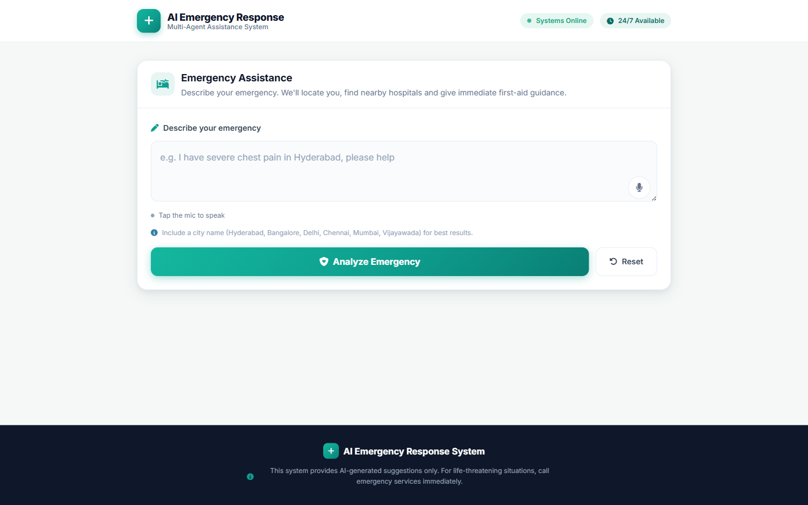
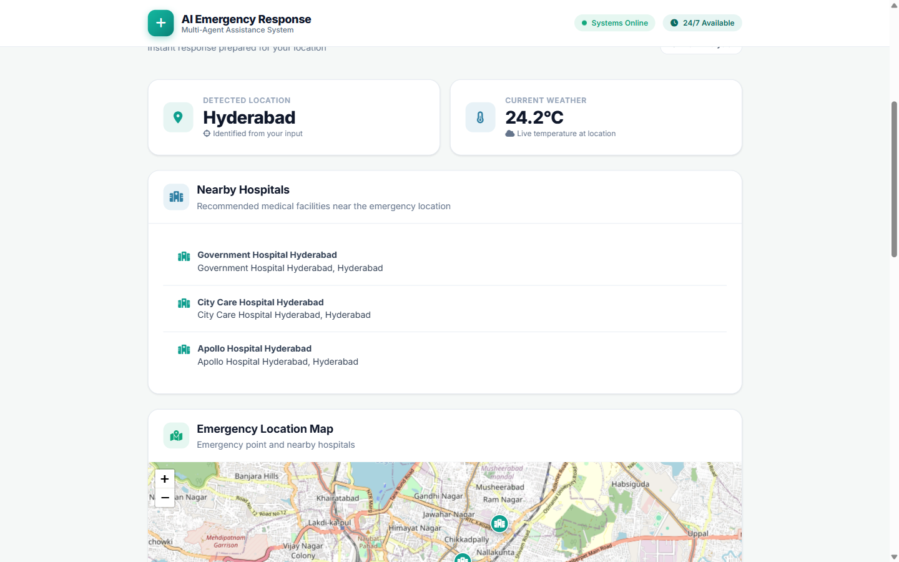
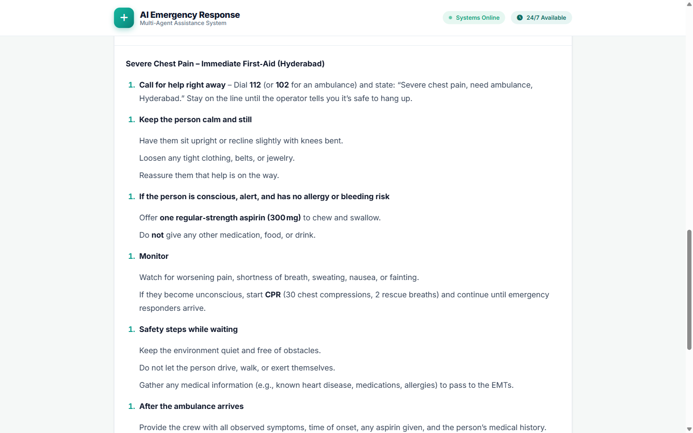
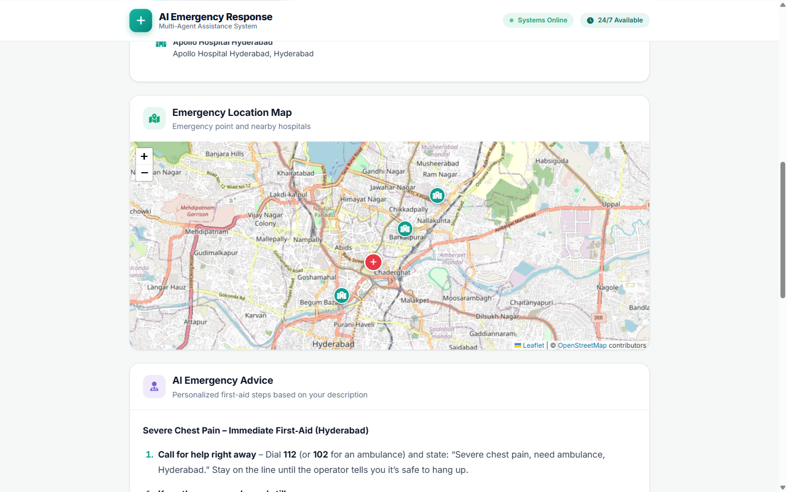

# AI Emergency Response System

An AI-powered **multi-agent emergency assistance platform** that analyzes a user's emergency description in real time and delivers **nearby hospitals**, **current weather**, **interactive map navigation**, and **AI-generated first-aid advice** — through a fast, mobile-friendly web interface.



---

## Features

- **Real hospital locations on an interactive map** — each hospital is plotted at its actual coordinates (OpenStreetMap) with hover tooltips, popup details, and a one-tap **"Get Directions"** link to Google Maps
- **Automatic location detection** — extracts the emergency city from the user's description
- **Live weather** at the emergency location
- **Streaming AI first-aid advice** — personalized, step-by-step guidance generated by Groq's LLM, streamed token-by-token via WebSocket
- **Voice input** — Web Speech API for supported browsers, with a mic button built into the input box (auto-stops when analysis begins)
- **Real-time agent status** — live progress of Location, Hospital, Weather, and AI Advisor agents during processing
- 🧭 **Emergency quick actions** — tap-to-call ambulance (108) and nearest-hospital navigation
- 📱 **Mobile-first responsive design** — hospital teal theme, works on phones, tablets, and desktops

---

## Tech Stack

| Layer | Technology |
|-------|-----------|
| **Backend** | Python · FastAPI · Uvicorn · WebSockets |
| **Frontend** | Vanilla HTML · CSS · JavaScript |
| **Maps** | Leaflet.js + OpenStreetMap |
| **LLM** | Groq API (streaming chat completions) |
| **Data Sources** | OpenStreetMap Nominatim (hospitals), OpenWeather (weather) |
| **Voice** | Web Speech API (browser) + backend fallback |

---

## Architecture

```
                    ┌────────────────────────────┐
                    │      FastAPI Backend       │
                    │        (backend/)          │
                    └──────┬─────────────────────┘
                           │
        ┌──────────────────┼──────────────────────┐
        │                  │                      │
   Location Agent    Hospital Agent          Weather Agent
   (agents/)         (agents/)               (agents/)
        │                  │                      │
        └──────────────────┼──────────────────────┘
                           │
                    ┌──────▼──────┐
                    │  AI Advisor │  (LLM — Groq)
                    └──────┬──────┘
                           │  streaming chunks
                    ┌──────▼──────┐
                    │  WebSocket  │  /ws/real-time
                    │  real-time  │
                    └──────┬──────┘
                           │
                    ┌──────▼──────┐
                    │   Frontend  │  Leaflet map + UI
                    └─────────────┘
```

The UI communicates with the backend over **WebSockets** while an analysis runs — agent statuses update live, and the AI advice streams in as it is generated. If the WebSocket is unavailable, the frontend gracefully falls back to the REST API.

---

## Project Structure

```
MULTI_AGENT_EMERGENCY_SYSTEM
│
├── backend/                  # FastAPI application
│   ├── main.py               # App, routes, WebSocket endpoint
│   ├── models.py             # Pydantic request/response models
│   └── websocket_manager.py  # WebSocket connection management
│
├── agents/                   # Domain agents (the "multi-agent" brain)
│   ├── coordinator_agent.py  # Orchestrates agent pipeline
│   ├── location_agent.py     # Extracts city from description
│   ├── hospital_agent.py     # Finds hospitals + real coordinates
│   ├── weather_agent.py      # Current temperature
│   ├── llm_advice_agent.py   # Streaming AI first-aid advice (Groq)
│   ├── voice_agent.py        # Voice transcription fallback
│   └── decision_agent.py     # Emergency severity decision logic
│
├── frontend/                 # Static web app
│   ├── index.html            # Semantic HTML5 structure
│   ├── styles.css            # Hospital teal theme, responsive design
│   ├── app.js                # Core logic, WebSocket client, markdown renderer
│   ├── map.js                # Leaflet map integration
│   └── voice.js              # Web Speech API voice input
│
├── docs/screenshots/         # README screenshots
├── requirements.txt
├── .env.example
├── .gitignore
└── README.md
```

---

## Getting Started

### Prerequisites

- Python **3.10+**
- A **Groq API key** — [grab one free here](https://console.groq.com)

### 1. Clone & install

```bash
git clone https://github.com/harshithnayak07/MULTI_AGENT_EMERGENCY_SYSTEM.git
cd MULTI_AGENT_EMERGENCY_SYSTEM

python -m venv .venv
```

#### Activate the virtual environment

**Windows (PowerShell)**
```powershell
.venv\Scripts\activate
```

**Linux / macOS**
```bash
source .venv/bin/activate
```

**Install dependencies**
```bash
pip install -r requirements.txt
```

### 2. Configure environment

Create a `.env` file in the project root (copy from `.env.example`):

```env
GROQ_API_KEY=your_groq_api_key
```

> **Note:** `.env` is gitignored — never commit your real API key.

### 3. Run the server

```bash
uvicorn backend.main:app --host 0.0.0.0 --port 8000 --reload
```

### 4. Open the app

```
http://127.0.0.1:8000
```

Use `--host 0.0.0.0` and your machine's LAN IP to access it from a phone on the same Wi-Fi.

---

## Usage

1. Type (or speak) your emergency — include a city name, e.g. *"severe chest pain in Hyderabad"*.
2. Click **Analyze Emergency**.
3. Watch the four agents run in real time.
4. Review your results:



5. Read the **AI first-aid advice** — streamed live, personalized to your description:



6. Use the **interactive map** — hover a hospital to see its name, click it to get details and **Get Directions** to its real location:



### Supported cities

| City | City |
|------|------|
| Delhi | Bangalore |
| Hyderabad | Chennai |
| Mumbai | Vijayawada |

---

## API Reference

FastAPI auto-generates interactive docs at **`http://127.0.0.1:8000/docs`** (Swagger UI).

| Method | Endpoint | Description |
|--------|----------|-------------|
| `POST` | `/api/emergency/analyze` | Full emergency analysis (location + hospitals + weather + advice) |
| `POST` | `/api/location/extract` | Extract city from text |
| `POST` | `/api/hospitals/find` | Find hospitals in a city |
| `GET` | `/api/weather/current` | Current temperature |
| `POST` | `/api/voice/process` | Voice processing (backend fallback) |
| `POST` | `/api/llm/advice` | Generate AI advice |
| `GET` | `/api/coordinates/{city}` | Coordinates for a supported city |
| `WS` | `/ws/real-time` | Real-time analysis with streaming updates |
| `GET` | `/health` | Health check |

### WebSocket message types

| Type | Purpose |
|------|---------|
| `connected` | Server confirms connection |
| `status` | Pipeline status updates |
| `agent_update` | Per-agent status (processing / complete) |
| `stream_chunk` | Streaming LLM advice chunks (`is_final: true` at end) |
| `complete` | Final results (location, hospitals, `hospitals_detail`, weather, advice) |
| `error` | Error notification |

---

## Voice Input

- Supported browsers use the **Web Speech API** directly (Chrome, Edge, Safari).
- Click the **mic icon** inside the input box to record; the final transcript is placed into the input field.
- The mic **automatically turns off** when recognition ends or when you click **Analyze Emergency**.
- If the Web Speech API is unsupported, the button is disabled gracefully (backend fallback is also available).

---

## Map Details

- **Emergency marker** (red cross) marks the detected emergency location.
- **Hospital markers** (teal) are placed at their **real coordinates** returned by OpenStreetMap — not random positions.
- The map auto-zooms to fit the emergency point plus all found hospitals.
- Each hospital popup includes the full address and a **Get Directions** link that opens Google Maps.

---

## Deployment

Deployment setup (Docker, cloud hosting, CI/CD) is documented as a follow-up. For now the app is 100% self-contained — a single FastAPI process serves both the API **and** the static frontend.

---

## Security Notes

- API keys live in `.env` and are **never committed**.
- LLM advice output is **HTML-escaped** before rendering to prevent XSS.
- Frontend falls back safely if WebSocket, geolocation, or voice permission fails.

---

## Disclaimer

This system provides **AI-generated suggestions only** and is not a substitute for professional medical advice. In a life-threatening emergency, **call your local emergency number immediately** (e.g., **108** in India).

---

## License

MIT License — free to use, modify, and distribute.